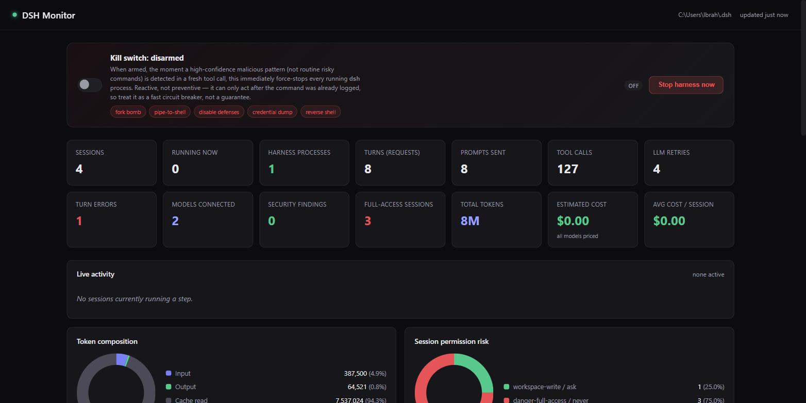
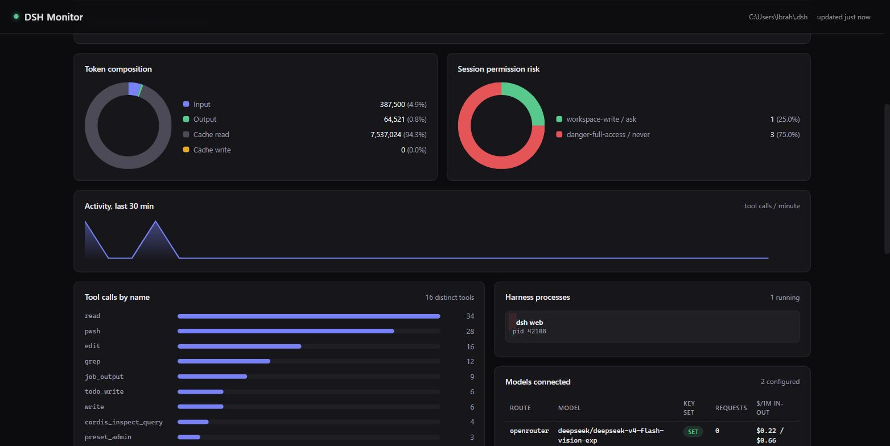

# DSH Monitor

A local, real-time observability dashboard for [DeepSeek Harness](https://github.com/deepseek-ai/deepseek-harness) (`dsh`) — token usage, cost, live agent activity, tool calls, permission/sandbox risk, and a reactive kill switch, all in one page.




## Why this exists

`dsh` is genuinely great — an open-source, plugin-composed agent harness that will happily run with `danger-full-access` sandboxing and no approval prompts if you tell it to. That's powerful. It's also exactly the kind of power that deserves a window into what's actually happening: how many tokens you've burned, what it's costing, what a running agent is doing *right now*, and whether anything it ran looked dangerous.

`dsh` doesn't ship anything like that today. The Web UI shows you one conversation at a time. There's no aggregate token/cost view, no cross-session activity feed, and no security signal beyond the raw per-session event log sitting on disk. If you're running multiple sessions, subagents, and workspaces — which the harness actively encourages — you're flying blind.

So this exists to fix that, entirely from the outside: **no `dsh` plugin, no fork, no changes to the harness at all.** It's a standalone Node app that reads the same files `dsh` already writes to disk and turns them into a live dashboard.

## What it shows

- **Headline stats** — sessions, running agents, harness processes, turns, prompts, tool calls, retries, errors, models connected, security findings, estimated cost
- **Live activity feed** — for every currently-running session: what it's doing right now (which tool, what command/description, or what it's reasoning/writing about), updated every 3 seconds
- **Token composition** and **session permission risk**, as donut charts
- **Activity sparkline** — tool calls per minute over the last 30 minutes
- **Tool-call and cost breakdowns** by name/model, as bar charts
- **Security findings** — a heuristic scanner runs over every prompt and tool-call argument in the logs, flagging destructive filesystem ops, pipe-to-shell patterns, credential dumping, reverse shells, secret literals, persistence mechanisms, and more
- **Permission/sandbox timeline** — every preset/sandbox/approval change across every session, flagged when it lands on `danger-full-access` or `never`
- **Estimated cost**, researched against real OpenRouter/DeepSeek pricing (see `lib/pricing.json`), split per session by which model(s) it actually used, plus a **token/cost trend chart** sampled once a minute (`lib/history.js`) so you get a real trend line, not just a live snapshot
- **Per-session drill-down** — click any session to see its full readable timeline (`session.html`): every prompt, tool call + result, permission change, turn/step boundary — reduced from the raw streaming event log (`lib/timeline.js` drops chunk-level noise and keeps what a human would want to read)
- **JSON/CSV export** — `/api/export.json` and `/api/export/sessions.csv`, linked from the header
- **Kill switch** — see below
- **A real preventive guard**, as a separate optional harness plugin — see [guardian-plugin/](guardian-plugin/)

## The kill switch

A toggle that arms a watchdog: the instant a *high-confidence* malicious pattern shows up in a fresh tool call (fork bomb, `curl | sh`-style pipe-to-shell, security-tool disabling, credential dumping, reverse shell), it force-kills every detected `dsh` process. There's also a manual "Stop harness now" button for an immediate kill regardless of arming state.

**Be clear-eyed about what this is and isn't:**

- It's **reactive, not preventive**. It can only act after `dsh` has already logged the tool call to disk — for a fast, single-shot destructive command, execution may finish before the kill lands. Treat it as a fast circuit breaker, not a guarantee.
- Auto-kill is deliberately restricted to a short allowlist of low-false-positive patterns. Things like `rm -rf` or `taskkill /f` are flagged and shown in the findings list, but excluded from auto-kill, because they're routine in normal dev work (`rm -rf node_modules`, killing a stuck dev server) and would make the switch fire constantly on legitimate commands.
- A real *preventive* block needs to run **inside** the harness process, with a hook that fires before dispatch. That turned out to exist: `dsh-tools` exposes `ctx.tools.guard()`, a synchronous callback evaluated after `tools/pre-execute` and before the tool body runs, which receives the tool's actual parsed arguments and can deny with a reason string. That's a real Cordis plugin, not a dashboard feature — see [guardian-plugin/](guardian-plugin/) for the implementation and why it's a materially stronger guarantee than this kill switch (and why `ctx.approval`, the seam that looked like the obvious place for this at first, isn't sufficient — it never sees a tool call's arguments, only its name).

## How it works (no `dsh` plugin required)

Everything is read directly from `~/.dsh` on disk, on a polling loop:

| Data | Source | Notes |
|---|---|---|
| Model/provider inventory | `~/.dsh/settings.yaml` (`llm-pi-ai.providers`) | Parsed with `js-yaml` |
| Per-session tokens, turns, running state | `~/.dsh/storages/session_projcache.json` | `sessionStats.openStep != null` is the "is this agent running right now" signal |
| Full event stream (tool calls, prompts, permission changes) | `~/.dsh/sessions/**/session.jsonl.zstd` | See below — this was the hard part |
| Harness processes | Windows process scan (`Get-CimInstance Win32_Process`) | Filtered to `@deepseek-ai/dsh` command lines only, dashboard's own process excluded |
| Credential presence | `HKCU\Environment` registry read | `process.env` alone only reflects vars set before *this* process started, not `dsh web`'s environment or a `setx` issued after either launched |

### The zstd multi-frame log format

`dsh` session logs are `session.jsonl.zstd` — but not a single zstd stream. Each append batch is compressed as its **own independent zstd frame**, and the frames are just concatenated in the file. Node's one-shot `zlib.zstdDecompressSync()` (and even the streaming `createZstdDecompress()`) only reads the *first* frame and silently stops there.

`lib/sessions.js` scans for zstd magic bytes (`28 B5 2F FD`) to find each frame's start offset, decompresses each frame separately, and concatenates the results. It also caches per-file decode state (size + last processed byte offset) so a poll only decodes *newly appended* frames instead of re-decoding the whole file every 3 seconds — this is what keeps the live view fast even as a session log grows past a megabyte.

## Monitoring a remote/multi-machine harness (OpenTelemetry bridge)

Everything above assumes this dashboard shares a filesystem with `dsh` — fine for local use, useless for a harness running somewhere else. `dsh` already ships `dsh-session-telemetry-otel`, an opt-in OTel log exporter; `lib/otel.js` implements a receiver for it (`POST /v1/logs`), grounded directly in that package's source (not guessed): it maps `attributes["session.id"/"event.type"/"event.seq"/"session.cwd"/"session.parent_id"]` and `body` (== the event's `.data`, `structuredClone`d) back into the exact same `{type, seq, time, data}` shape the local zstd-log reader produces, so OTel-sourced sessions flow through the identical aggregation/timeline code as local ones — they just show up tagged `source: otel` instead of `source: local`.

To point a `dsh` instance at this dashboard, add to its profile config (e.g. via `cordis.patch.yml`, same mechanism `guardian-plugin/README.md` documents):

```yaml
- insert:
    - id: sessionTelemetry-otel
      name: '@deepseek-ai/dsh-session-sessionTelemetry-otel'
      config:
        mode: FULL
        exporter:
          url: http://<this-dashboard-host>:4590/v1/logs
```

Read `dsh-session-telemetry-otel`'s own README before enabling `FULL` mode on anything you don't fully trust the destination of: it exports the complete raw event content (message text, tool arguments/output, system prompt), unredacted by default.

## Cost estimation

`lib/pricing.json` holds researched per-model pricing (USD / 1M tokens). A session's cost is split across whichever model(s) it used, weighted by each model's share of requests within that session (the log only carries per-session token totals, not a per-request breakdown, so this is a weighted approximation, not exact accounting). Models with no pricing entry are marked as unknown rather than silently costed at $0.

## Prerequisites

This dashboard doesn't bundle or depend on the harness's source code — it only reads the runtime files `dsh` writes to `~/.dsh` (settings, session logs), so all you need is the CLI itself:

```bash
npm install -g @deepseek-ai/dsh
dsh web
```

That starts the harness's own Web UI at `http://127.0.0.1:3080`. Use it for at least one session (send a prompt, run a tool) so `~/.dsh` has something to read — the dashboard shows an empty state gracefully, but there's nothing to look at until `dsh` has written some data.

Upstream source: [deepseek-ai/deepseek-harness](https://github.com/deepseek-ai/deepseek-harness) · fork: [ibrahimsaleem/deepseek-harness](https://github.com/ibrahimsaleem/deepseek-harness)

## Running it

```bash
npm install
npm start
```

Opens on `http://127.0.0.1:4590`, bound to localhost only. Override with `DASHBOARD_PORT` and `DSH_HOME` env vars if needed.

## What's next

This started as "I want to see what my harness is doing" and turned into a real observability layer built entirely from the outside, plus one small piece (`guardian-plugin/`) that runs inside. Everything originally on the roadmap has shipped:

- ~~[Historical trend charts](https://github.com/ibrahimsaleem/dsh-dashboard/issues/1)~~ — done (`lib/history.js`, the Token/Cost trend panels)
- ~~[Per-session drill-down pages](https://github.com/ibrahimsaleem/dsh-dashboard/issues/2)~~ — done (`session.html`, `lib/timeline.js`)
- ~~[CSV/JSON export](https://github.com/ibrahimsaleem/dsh-dashboard/issues/3)~~ — done (`/api/export.json`, `/api/export/sessions.csv`)
- ~~[OpenTelemetry bridge](https://github.com/ibrahimsaleem/dsh-dashboard/issues/4)~~ — done (`lib/otel.js`, `POST /v1/logs`)
- ~~[A real preventive mode](https://github.com/ibrahimsaleem/dsh-dashboard/issues/5)~~ — done (`guardian-plugin/`), via `ctx.tools.guard()` rather than the approval seam originally guessed at

Since then, shipped:

- **Remote fleet view** — OTel-sourced sessions get their own panel (source host, event count, first/last-seen, a "reporting"/"stale" health badge based on wall-clock receipt time, not just event timestamps) instead of only being tagged `source: otel` in the shared tables
- **Paginated session drill-down** — a busy session's timeline could run into the hundreds of events; `/api/session/:id` now returns the most recent 100 by default with a `beforeSeq` cursor for a "load earlier events" button, and turn/step boundary markers render as thin dividers instead of full cards so the meaningful content (prompts, tool calls, messages) isn't buried

Ideas for where it goes from here — genuinely open, none of these are scoped yet:

- Redaction rules for the OTel path, since `FULL` mode ships raw message/tool content by default
- Expanding `guardian-plugin`'s rule set past the 5 seed patterns, and packaging it for easier install (right now it's a manual `cordis.patch.yml` edit)
- Multi-user/team view if this ever needs to watch more than one person's harness

Contributions and ideas welcome — this is meant to be a starting point for harness observability, not a finished product.

## License

MIT
